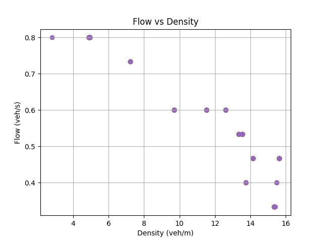
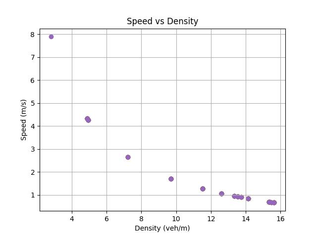

# ITSC 2024 Reproducibility in Transportation Research: A Hands-on Tutorial

Author: Jonathan Sprinkle

Based on an original example from Cathy Wu as part of the 
Reproducible Research Workshop at ITSC 2024
Tutorial link: https://rrintransportation.github.io/itsc24-rr-tutorial/

The default simulations should match the below files:
 

## Requirements

Create a new conda environment
```
conda env create -f environment.yml
conda activate RR
```

## Run the baseline example

From the command line, invoke the simulator:

```
python simulator.py --run-idm --no-render
```

Compare your output files `figure_fvd.png` and `figure_svd.png` to the default files provided by the repository.


